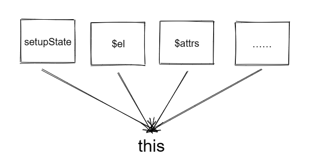
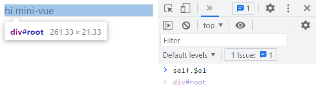

### 在 render option 中访问 this

​	在实现 *组件的初始化流程* 功能时，我们暂时跳过了一个功能：在 render option 中通过 `this` 访问 setup option 所返回的 state。

​	render option 是一个函数，如果单纯的只是像访问 setup option 所返回的 state，实现起来也很简单：当调用 render option 时，让 this 指向 setup option 执行的结果即可。

*示例代码*

```
export const App = {
  render(h) {
    return h("div", { id: "root" }, "hi " + this.message);
  },
  setup() {
    return {
      message: "mini-vue",
    };
  },
};

```

​	组件初始化流程结束时，会在 setupRenderEffect 中初始化子树，也就是 render option 调用的地方，此时绑定 render option 的 this 为 setup option 的执行结果即可。

```
function setupRenderEffect(instance, container) {
  const subTree = instance.render.call(instance.setupState, h);
  patch(subTree, container);
}
```

​	看起来很完美，不过我们在使用 vue 时，神奇的 this 不仅仅能访问 setup option 所返回的 state。还能访问其它一系列属性，比如：$el、$slots、$attrs 等等。

​	因此，this 的含义也就不那么单一了。



### 实现组件代理对象

我们可以通过 `Proxy` 将各种 key 的访问统一起来，实现的思路如下：

1. 在初始化具有状态的组件时(也就是 `setupStatefulComponent` 方法)，向组件实例上追加一个 proxy 属性，用于存储被代理过的实例，当外部访问 this 时，就会通过这个代理对象间接访问。
2. 利用 getter 进行拦截，判断 key 究竟属于谁，再返回对应的结果。例如：
   * 如果当前访问的 key 在 setupState 中，就从 setupState 取结果
   * 如果等于 $el 等等这些公共的 api ，就返回对应的值

#### 具体实现

 ***访问 setupState***

`setupStatefulComponent`

```
function setupStatefulComponent(instance) {
  instance.proxy = new Proxy({},
    {
      get(_target, key) {
        const { setupState } = instance;
        if (key in setupState) return setupState[key];
      },
    }
  );
  …………
}
```

`setRenderEffect`

```
function setupRenderEffect(instance, container) {
  const subTree = instance.render.call(instance.proxy, h);
  patch(subTree, container);
}
```

***访问 $el***

组件的 $el，也就是组件的 root element ，即下面示例代码中 `h` 函数创建出来的 `<div id="root">`

```
export const App = {
  render(h) {
    return h("div", { id: "root" }, "hi " + this.message);
  },
  setup() {
    return {
      message: "mini-vue",
    };
  },
};
```

而这个 root element 被创建的时机是在 `mountElement` 函数中，也就是在组件初始化完毕 `setRenderEffect` 的渲染子树逻辑中。

而 `mountElement` 中的 vnode ，也就是 App 组件的子树( subTree )。

我们可以在 `mountElement` 所取的 vnode 上存储下来 el，然后等整个 path 流程走完，也就是 App 组件的 `setupRenderEffect` 执行完毕时，再把之前在 subTree 中存储的 el 存储到 App 组件的 vnode 上，这样我们就可以通过组件实例去访问对应的根节点了（instance.vnode.el）

>其实 el 存储到组件实例上的流程，也就是递归调用 path 之后的回溯流程，只不过我们在回溯的过程中收集了一些数据。

*代码实现：*

```
function mountElement(vnode, container) {
  const el = (vnode.el = document.createElement(vnode.type));
  ……
}
```

```
function setupRenderEffect(instance, vnode, container) {
  const subTree = instance.render.call(instance.proxy, h);
  patch(subTree, container);
  vnode.el = subTree.el;
}
```

instance.proxy 的 getter 拦截 $el 的访问

```
function setupStatefulComponent(instance) {
  instance.proxy = new Proxy({},
    {
      get(_target, key) {
        const { setupState } = instance;
        if (key in setupState) return setupState[key];
		if (key === "$el") return vnode.el;
      },
    }
  );
  …………
}
```

#### 调试tips

如果直接在 App 组件的 render option 中打印 `this.$el`，控制台会输出 undefined。

原因：`el` 存储到组件实例的时机是在 render option 执行完毕后，因此目前直接在 render option 中不能拿到 `this.$el`。

*解决*

我们可以利用 window 全局对象，将 this 缓存起来，然后直接在控制台中通过 window 中缓存的这个 this 去读取 $el

```
window.self = undefined;
export const App = {
  render(h) {
    window.self = this;
    return h("div", { id: "root" }, "hi " + this.message);
  },
  setup() {
    return {
      message: "mini-vue",
    };
  },
};
```

