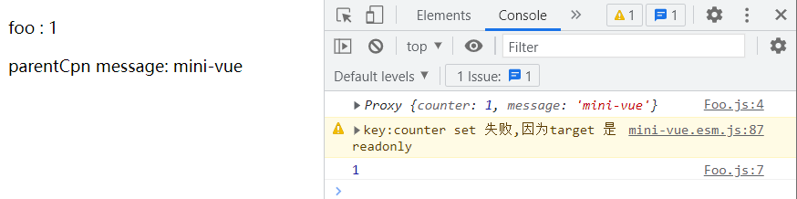
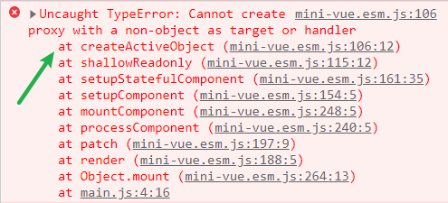
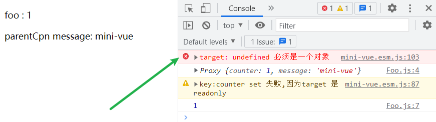

## props 需求点

在实现 props 的逻辑之前，我们先来简单总结一下 props 的需求点都有哪些：

1. setup 能够通过第一个参数访问 props
2. render 中能够通过神奇的 this 访问 props
3. props 在子组件中需要转化为 shallowReadonly

示例：

App.js

```
import FooCpn from "./Foo.js";

export const App = {
  render(h) {
    return h("div", { id: "root" }, [
      h(FooCpn, { counter: 1, message: this.message }),
    ]);
  },
  setup() {
    return {
      message: "mini-vue",
    };
  },
};
```

Foo.js

```
const FooCpn = {
  setup(props) {
    //1.setup 接受props
    console.log(props);
    //3.props shallow readonly
    props.counter++;
    console.log(props.counter);
  },
  render(h) {
    //2. render 中可以通过this访问props中的property
    return h("div", { class: "foo-cpn" }, [
      h("p", {}, `foo : ${this.counter}`),
      h("p", {}, `parentCpn message: ${this.message}`),
    ]);
  },
};

export default FooCpn;
```

期望结果：



## 代码实现

### setup 能够通过第一个参数访问 props

​	要实现这个需求很简单，只需要在 setup option 被调用时（setupStatefulComponent），传入 instance.vnode.props 即可。

```
function setupStatefulComponent(instance) {
  instance.proxy = new Proxy({ _: instance }, PublicInstanceProxyHandlers);
  const Component = instance.type;
  const { setup } = Component;
  if (setup) {
    const setupResult = setup(instance.vnode.props);
    handleSetupResult(instance, setupResult);
  }
}
```

不过后期在访问 props 时，我们不希望总是通过 vnode 访问，而是希望直接通过 instance 访问

```
const setupResult = setup(instance.vnode.props); （×）
```

```
const setupResult = setup(instance.props); （√）
```

这个也很好实现，就像把 vnode.type 追加到 instance 一样，我们只需要在 instance 上存储一份 vnode.props 即可。那这个逻辑写在哪里比较好呢？

​	还记不记得 mountComponent 中我们预留了两个 todo？

1. initProps
2. initSlots

我们只需要在 initProps 中，将未经处理的 vnode.props 追加到 instance.props 上即可。

创建 `componentProps.ts`，将相关逻辑抽离

```
export function initProps(instance, rawProps) {
  instance.props = rawProps
}
```

这样，我们在调用 setup option 时只需要传入 instance.props 即可

### render 中能够通过神奇的 this 访问 props

​	这个需求也很好实现，因为我们之前已经实现了 `组件实例对象的代理` 我们只需要判断 key 是否属于 instance.props 即可。

```
import { hasOwn } from "../shared/index";

const publicPropertiesMap = {
  $el: (i) => i.vnode.el,
};

export const PublicInstanceProxyHandlers = {
  get({ _: instance }, key) {
    const { setupState, props } = instance;

    if (hasOwn(setupState, key)) return setupState[key];
    if (hasOwn(props, key)) return props[key];

    const publicGetter = publicPropertiesMap[key];
    if (publicGetter) return publicGetter(instance);
  },
};
```

​	只不过这里把判断 key 属于谁的逻辑抽离成了 hasOwn 方法

shared -> index.ts ->hasOwn

```
export function hasOwn(target, key) {
  return Object.prototype.hasOwnProperty.call(target, key);
}
```

### props 在子组件中需要转化为 shallowReadonly

shallowReadonly 的逻辑，我们曾经在 reactivity 模块中已经实现了，我们直接拿来用即可。

传入 props 给 setup option 时，把 props 使用 shallowReadonly 包裹即可。

```
const setupResult = setup(shallowReadonly(instance.props));
```

不过你会发现，此时代码并不能成功 run 起来：



报错告知我们：在设置 proxy 时，不能处理非对象；问题出现在 createActiveObject 方法中

这是我们在实现 createActiveObject 时候疏忽的一个边界 case，我们只需要兼容一下即可：

```
function createActiveObject(target, baseHandler) {
  if (!isObject(target)) {
    console.error(`target: ${target} 必须是一个对象`);
    return target;
  }
  return new Proxy(target, baseHandler);
}
```

现在发现，页面已经能够成功渲染了：


同时发现：createActiveObject 的确接受到了一个 undefined（非 object）

***其实原因也很简单：***

​	在初始化根组件 App 时，我们先使用 createVNode 将其转化为虚拟节点，并且此时不需要传入 props 与 children，也就意味着此时 props 为 undefined；后续 mountComponent -> initProps 时，保留在 instance 中的 props 也同理为 undefined；当把 props 包裹为 shallowReadonly 传入 setup option 时，也为 undefined。

​	而设置 shallowReadonly 过程，也就是代理的过程，需要走 createActiveObject 逻辑，因此会报错。

***解决：***

​	虽然这个报错不会影响到现有逻辑，不过我们也可以解决一下。我们只需要在初始化 props 时，判空一下即可（`props ?? {}`）。

​	至于在哪里判空，其实有两个入口，任改其一即可：

1. createVode
2. initProps

官方是在 initProps 中判空的，猜测是因为这样不影响 vnode 中 props 的真实性，只在 instance 中缓存的 props 进行操作。

```
export function initProps(instance, rawProps) {
  instance.props = rawProps ?? {};
}
```

