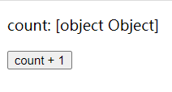
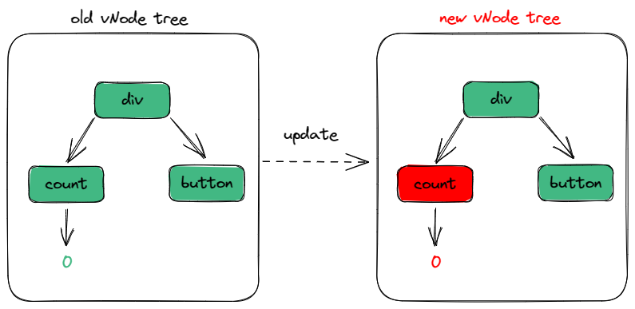
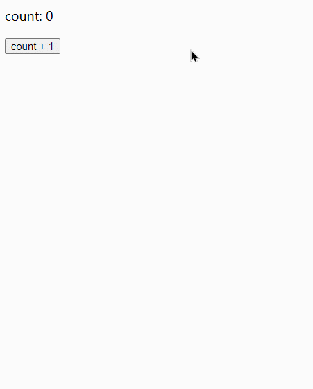
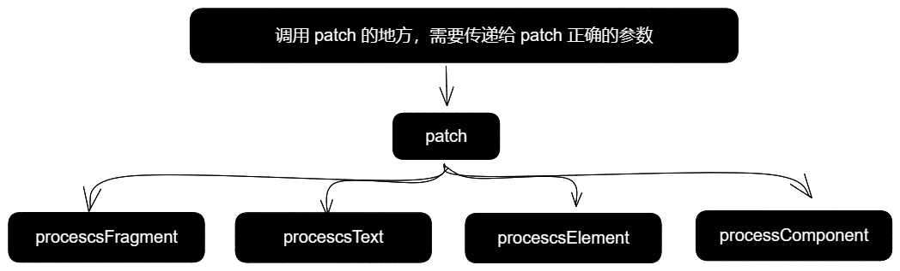

## 前言

​	前面我们已经编写了 vnode 的挂载流程，还是实现了一些基础功能和 api，现在我们开始着手于 vnode 的更新流程，本章将关注 element 类型的 vnode 更新流程。

​	本文讲解 element 类型的 vnode 主要更新流程搭建，意在了解更新的主流程，暂不实现细节。

## 逻辑梳理

***example code***

​	该示例代码将贯穿本文所讲解的 element 类型的 vnode 主要更新流程。

```
import { ref } from "../../lib/mini-vue.esm.js";

export const App = {
  setup() {
    const count = ref(0);
    const increment = () => {
      count.value += 1;
    };
    return { count, increment };
  },
  render(h) {
    return h("div", {}, [
      h("p", {}, `count: ${this.count}`),
      h(
        "button",
        {
          onClick: () => {
            this.increment();
          },
        },
        `count + 1`
      ),
    ]);
  },
};
```

### 在模板中解包 ref

​	我们先来 run 一下上面的示例代码，结果发现，count 渲染结果是 `[object Object]`：



​	这并不意外，因为 ref 是一个 `RefImpl` 类所创建出来的 Object ，而将其放到字符串中会自动执行 toString 方法，从而渲染出 `[object Object]`。

​	这个问题所产生的需求显而易见：我们希望访问 ref state 时，自动解包出 value 即可。

​	**方法很简单：使用** `proxyRefs` **去代理组件实例中的 setupState 即可。**

>* 在 render 函数中通过 this 访问的响应式变量来源于 setup option object result
>* 而 this 实际上是组件实例 instance 的 proxy 代理对象(PublicInstanceProxyHandlers)，通过这个 proxy 间接访问组件实例暴露的各种 api
>* 如果匹配到 key 在 setupState 中，将会从 setupState 中取数据

在 `handleSetupResult` 方法中，给 instance.setupState 赋值的地方使用 `proxyRefs` 代理下即可

```
instance.setupState = proxyRefs(setupResult);
```

### 更新流程核心思想

​	当触发更新时，要生成一个新的 vnode tree ，后期再让这个 new vnode tree 与 old vnode tree 进行比较，将发生改变的地方进行更新。



* 当然，具体怎么比较是一个算法问题，我们可以先不关注这个具体细节实现，先着重考虑如何拿到新旧 vnode tree
* vnode tree 的数据源是 component 的 render option，而 runtime-core 调用 redner option 的地方在 `setupRenderEffect` 中
* 因此当 state 变更时，我们期望重新执行 component 的 render option 从而拿到最新的 vnode tree

### 将 reactivity 与 runtime 连接起来

​	而当 state 发生变更，重新执行 component 的 render option 就涉及到了一个问题：如何将 reactivity 与 runtime 连接起来？

​	在实现 reactivity 时，我们知道：像 reactive、ref 这种响应式数据，当数据发生变更时，会完成事件的发布，而 effect 函数用于收集这些响应式数据所依赖事件。effect + 响应式变量，能够完成发布订阅的整个流程。

​	依据现在的需求（当 state 变更时，我们期望重新执行 component 的 render option 从而拿到最新的 vnode tree），我们应该将 render option 执行的逻辑使用 effect 订阅，当 state 变更时，就会发布事件，从而再次执行 effect 中所订阅的逻辑，就能够拿到最新的 vnode。

<span id='将 reactivity 与 runtime 连接起来_setupRenderEffect'>代码实现：</span>

```
  function setupRenderEffect(
    instance,
    initialVnode,
    container,
    parentComponent
  ) {
    effect(() => {
      const subTree = instance.render.call(instance.proxy, h);
      patch(subTree, container, parentComponent);
      initialVnode.el = subTree.el;
    });
  }
```

我们再 run 一下代码，查看结果：



可以发现，我们已经实现了页面更新，并且呈现在页面上的 state 也更新了。

​	当然了，你会发现结果有些奇怪 (新的 vnode tree 不断被追加到页面上)，不过这都在意料之中，因为 effect 订阅的副作用函数会执行 patch，而 patch 中的 `processElement -> mountElement` 会将 el 追加到父级容器中。

​	由于现有的 runtime-core 代码逻辑中没有关于 update 的逻辑，所以我们需要改造现有代码，将更新逻辑预留出来，而不是无脑的执行现有的 mount 逻辑。

### 改造现有代码,预留 update 逻辑

#### 改造思路梳理

​	既然要预留 update 逻辑，我们就要知道 update 逻辑需要什么，在 [更新流程核心思想](###更新流程核心思想) 中我们已经知道了 update 需要拿到新旧 vnode tree。

​	并且，我们需要能够区分应该执行 mount 与 update 哪一个流程，不然就会出现上图中的问题。

因此，改造逻辑涉及以下几点：

1. 区分 mount 与 update 流程
2. 保存新旧 vnode tree
3. 将新旧 vnode tree 传入到 patch 的子流程当中
4. patch 的子流程预留 update vnode 流程

#### 区分 mount 与 update 流程

在 component instance 中，预留一个开关变量 `isMounted`，用于记录组件是否被挂载过。

<span id='区分 mount 与 update 流程_createComponentInstance'>更新 `createComponentInstance` 代码</span>

```
export function createComponentInstance(vnode, parent) {
  ……
  const component = {
    ……
    isMounted: false
  };
  ……
  return component;
}
```

然后在 `setupRenderEffect` 中的 effect 副作用函数执行时，根据 `instance.isMounted` 判断组件是 mount 还是 update。

#### 保存新旧 vnode tree

​	在 [将 reactivity 与 runtime 连接起来](###将 reactivity 与 runtime 连接起来) 中我们已经能够拿到 new vnode tree 了，只不过我们现在需要将新旧 vnode tree 保存下来，再传递给 patch。

​	在 component instance 中，预留一个变量 `subTree`，用于记录组件当前的 vnode tree，当下次走 update 流程时，就能够通过 `instance.subTree` 拿到旧的 vnode tree。

更新 <a href='#区分 mount 与 update 流程_createComponentInstance'>createComponentInstance</a> 代码

```
export function createComponentInstance(vnode, parent) {
  ……
  const component = {
    ……
    isMounted: false,
    subTree: null
  };
  ……
  return component;
}
```

* 在 `setupRenderEffect` 中的 effect 副作用函数中，不断收集新旧 vnode tree 
  * 在 mount 和 update 流程中，都要不断收集，保证收集新旧 vnode tree 的正确性

<span id='保存新旧 vnode tree_setupRenderEffect'>更新 <a href='#将 reactivity 与 runtime 连接起来_setupRenderEffect'>setupRenderEffect</a> 代码</span>

```
  function setupRenderEffect(
    instance,
    initialVnode,
    container,
    parentComponent
  ) {
    effect(() => {
      if (!instance.isMounted) {
        const { proxy } = instance;
        const subTree = (instance.subTree = instance.render.call(proxy, h));
        patch(subTree, container, parentComponent);
        initialVnode.el = subTree.el;

        console.log("init", subTree);

        instance.isMounted = true;
      } else {
        const { proxy } = instance;
        const subTree = instance.render.call(proxy, h);
        const prevSubTree = instance.subTree;

        console.log("current tree", subTree);
        console.log("prev tree", prevSubTree);

        instance.subTree = subTree;
      }
    });
  }
```

此时 run 一下代码，可以看到控制台的打印结果，能够拿到新旧 vnode tree 了。

#### 将新旧 vnode tree 传入到 patch 的子流程当中

​	在上述 `setupRenderEffect` 的 update 逻辑中，我们只是正确保存了新旧 vnode tree，但 update 流程也需要进行 patch，并且要把新旧 vnode tree 传入到 patch 的子流程当中。

​	因此我们需要更改 patch 函数的入参，以及 patch 子流程函数的入参，让它们都能够接收新旧 vnode tree。

*old Patch function*

```
function patch(vnode, container, parentComponent) { …… }
```

*new Patch function*

* n1: old vnode tree
* n2: 相当于原来接收的 vnode，含义为 new vnode tree
* 后续 patch 子流程函数的入参调整同理

```
function patch(n1, n2, container, parentComponent) { …… }
```

***所需要调整入参的函数总结：***此外，调用 patch 的地方，需要传递给 patch 正确的参数




更新 <a href="#保存新旧 vnode tree_setupRenderEffect">setupRenderEffect</a>

```
function setupRenderEffect(
    instance,
    initialVnode,
    container,
    parentComponent
  ) {
    effect(() => {
      if (!instance.isMounted) {
        ……
        patch(null, subTree, container, parentComponent);
        ……
      } else {
        ……
        patch(prevSubTree, subTree, container, parentComponent);
		……
      }
    });
  }
```

#### patch 的子流程预留 update vnode 流程

​	目前，我们只关注 `processElement` 流程

1. n1 不存在，代表是第一次 processElement，需要走 mounte
2. 反之，需要走 update 逻辑（patchElement）

更新 `processElement` 代码

```
  function procescsElement(n1, n2, container, parentComponent) {
    if (!n1) {
      mountElement(n2, container, parentComponent);
    } else {
      patchElement(n1, n2, container, parentComponent);
    }
  }
```

预留 `patchElement` 方法

```
  function patchElement(n1, n2, container, parentComponent) {
    console.log("patchElement");
    console.log("current tree", n2);
    console.log("prev tree", n1);
  }
```

​	此时 run 一下代码，点击 `counte + 1` 按钮，出发 update 逻辑，当走到 `patchElement` 函数时，就能够打印正确的新旧 vnode tree。

​	本文主要讲解 update element 的主流程，暂时不实现 `patchElement` 的细节，后续我们将在`patchElement`  中实现对比和更新 props、children。