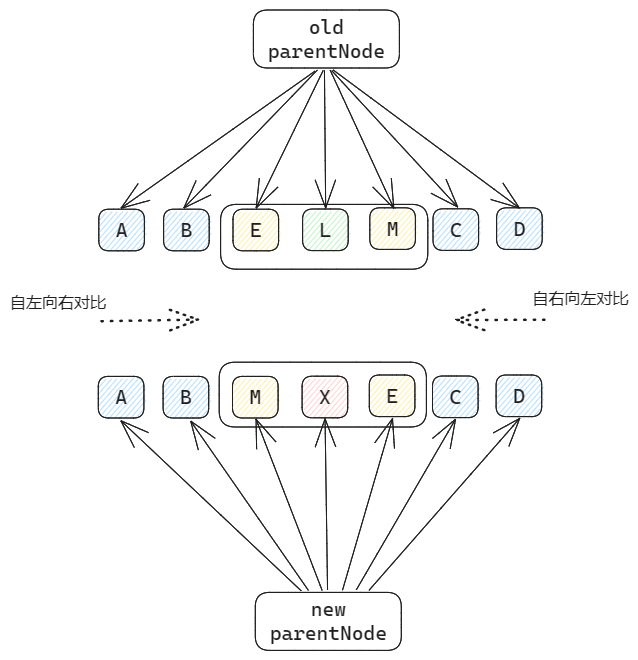
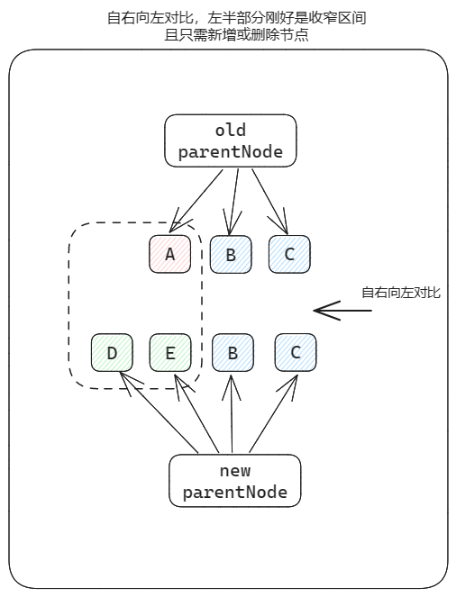
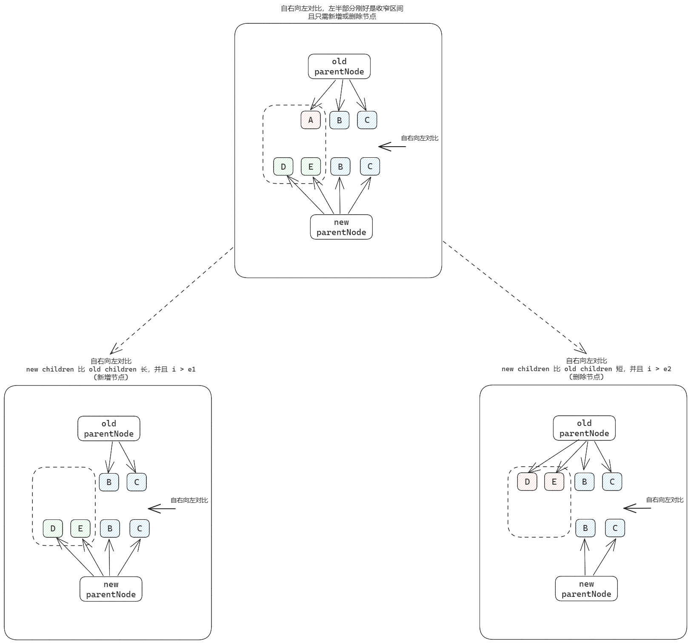

## 算法核心需求

​	之前我们讲过，vue 的 diff 算法是用于处理 patchChildren 中 ArrayToArray 的情景，在前端应用的大部分场景下，新旧 children 中有很多节点是没有改变或变化比较小的 (例如只更新了一些props)，对于这些 `不变/变化小` 的节点，我们没有必要将其卸载再重新挂载。因为如果这样的节点很多，就意味着要浪费大量的性能。

​	为了提高性能，diff 算法将尽力保留 `不变/变化小` 的节点，只需要对这些节点打一个补丁即可。而这个过程就是 vue diff 算法中进行双向对比的过程：

1. 先对比左侧，vnode 的 type 与 key 都相同，则只对节点进行 patch，指针右移，直至找到不同处 x
2. 再对比右侧，vnode 的 type 与 key 都相同，则只对节点进行 patch，指针左移，直至找到不同处 y

经过前面两步骤，我们只是尽力保留了两端的 `不变/变化小` 的节点，但同时我们得到了 [x,y] 这个区间，该区间就是乱序的部分，也是 diff 算法核心处理的部分，在这个乱序区间内，我们会遇到下面这 3 中场景：

1. 遇到新节点就创建
2. 遇到不存在的节点就删除
3. 遇到已存在的节点，但可能顺序变了，就要将这些节点进行移动

双端对比算法的核心，就是找到中间乱序的部分，尽力收窄处理的区间，从而提高性能。

## 逻辑拆分

​	要实现这个 diff 算法，是有很多 case 需要处理的。不过我们可以将这些 case 进行拆分。

1. 将大问题拆成多个小问题，分而治之
2. 观察小问题是否可以继续拆分，再将小问题逐步实现，最终实现整套逻辑

### 自左向右对比

自左向右对比，找到不同处，指针停止移动。此时右半部分恰好就是要处理的区间，**并且只需新增或删除节点**

而该种情况，又可以再拆分成两种特殊的case：

1. new children 比 old children 长，并且只需要新增节点
2. new children 比 old children 短，并且只需要删除节点

### 自右向左对比

自右向左对比，找到不同处，指针停止移动。此时左半部分恰好就是要处理的区间，**并且只需新增或删除节点**

同理，该情况，也可以再拆分成两种特殊的case：

1. new children 比 old children 长，并且只需要新增节点
2. new children 比 old children 短，并且只需要删除节点

### 关键拆分点

上面我们拆分了两种情况：

1. 自左向右对比过程
2. 自右向左对比过程

并对逻辑拆分点做了约束：**只需要新增或删除节点**

为何要这样拆分呢？我们再来回顾下 <a href='#双端对比算法的核心'>双端对比算法的核心</a>，而处理这个乱序区间，又分为以下 3 种场景：

1. 遇到新节点，进行创建
2. 遇到不存在的节点，进行删除
3. 新旧 children 中都存在某些节点，但它们的位置不同，需要进行移动

而在这 3 种场景中：

* 场景一和二很显然是比较原子化的操作，具体逻辑都是功能上的实现。
* 而场景三就是偏逻辑方向的，会有一些边界条件要处理。

所以先把简单的场景一和二进行拆分，把这些原子化的功能进行实现并封装，后面在处理比较通常化的逻辑时，也可以更好的复用。

## 思路总结

双端对比算法的核心，就是找到中间乱序的部分，尽力收窄处理的区间，从而提高性能。

可以先把双端对比的过程简单拆分成两大类：

1. 自左向右对比，直至找到不同处，并且右半部分刚好是目标处理区间，而且只需要新增或删除节点即可
2. 自右向左对比，直至找到不同处，并且左半部分刚好是目标处理区间，而且只需要新增或删除节点即可

针对 `新增或删除节点`，再分别将两种情况各自细化：

1. new children 比 old children 长，并且只需要新增节点
2. new children 比 old children 短，并且只需要删除节点

逻辑拆分总图如下：

* 自上而下，逻辑拆分，分而治之
* 自下而上，逐一实现简单case，最终实现整体功能

