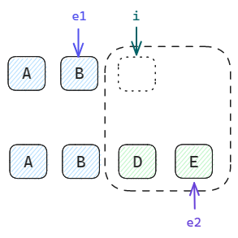
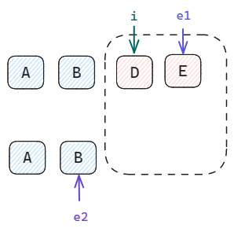
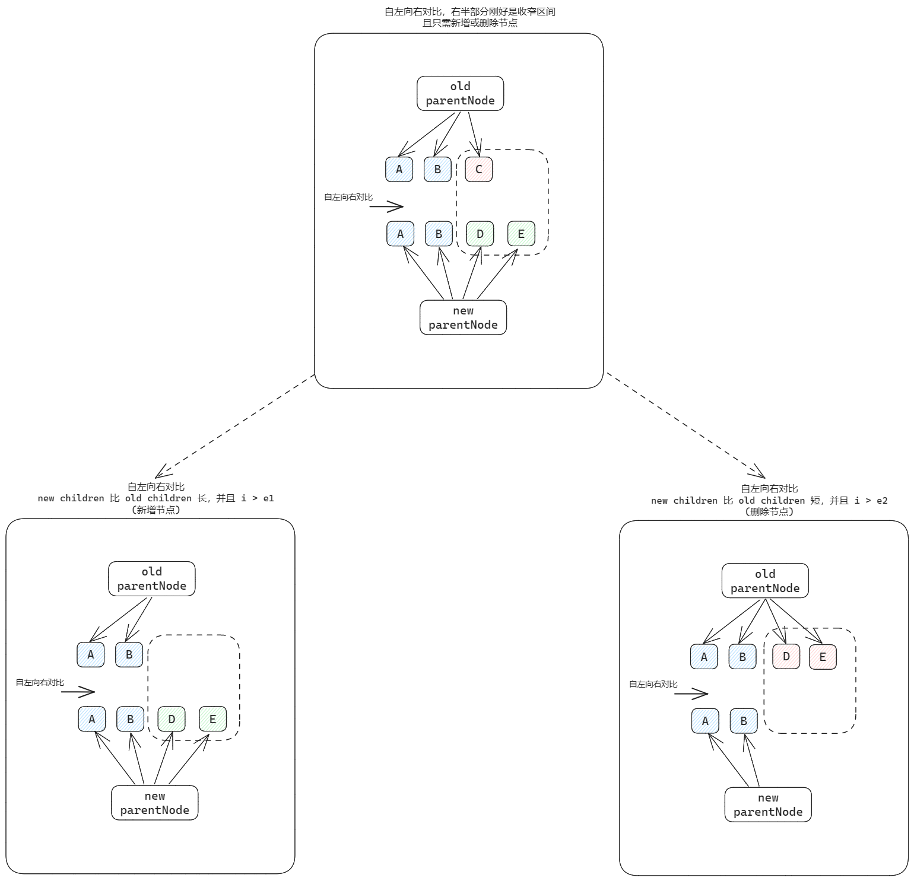
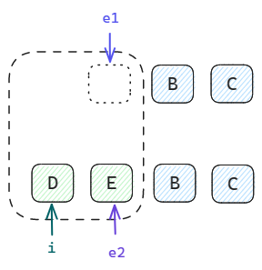
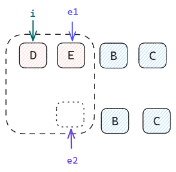

# 前言

​	前面我们已经对双端对比算法的整体框架进行了思路梳理，现在让我们一起来用代码进行具体实现。

### 功能点

​	而实现的具体功能点，就是上篇文章中所拆分的各种特殊case，它们也是双端对比算法中比较基础的case。

1. 自左向右对比后，右侧部分正好是待处理区间，且只需要新增或删除节点
2. 自左向右对比后，右侧部分正好是待处理区间，且只需要新增或删除节点

这两种情况各自又可以再拆分，特殊化为：

* newChildren.length > oldChildren.length, 且只需要新增节点
* newChildren.length < oldChildren.length, 且只需要删除节点

### 设计指针

 	既然要进行双端对比，肯定要使用一些指针来进行索引，通过分析可知，双端对比算法只需要三个指针：

* 自左向右对比：只需一个指针 i
* 自右向左对比：需要定义 e1、e2 指针，分别指向新旧 children 的尾部

由于双端对比算法处理的是 ArrayToArray 的情景，而自左向右对比对于数组来说都是从 0 开始，因此只需要一个指针 i 即可；但自右向左对比就不同了，由于不能保证新旧 children 的长度一致，因此需要定义两个指针 e1、e2 来分别指向新旧 children 的尾部。

# 代码实现

### example code

```
import { useState } from "./hooks.js";

/**
 * 1.自左向右对比，找到不同处，指针停止移动。
 *   此时右半部分恰好就是要处理的区间
 *   并且只需新增或删除节点
 */
////1.1 new children 比 old children 长 (新增节点)
const oldArray = ["A", "B"];
const newArray = ["A", "B", "D", "E"];

//// 1.2 new children 比 old children 短 (删除节点)
// const oldArray = ["A", "B", "D", "E"];
// const newArray = ["A", "B"];

/**
 * 2.自右向左对比，找到不同处，指针停止移动。
 *   此时左半部分恰好就是要处理的区间
 *   并且只需新增或删除节点
 */
////2.1 new children 比 old children 长 (新增节点)
// const oldArray = ["B", "C"];
// const newArray = ["D", "E", "B", "C"];

//// 2.2 new children 比 old children 短 (删除节点)
// const oldArray = ["D", "E", "B", "C"];
// const newArray = ["B", "C"];

export default {
  setup() {
    const [convert, setConvert] = useState(false);
    window.setConvert = setConvert;
    return {
      convert,
      setConvert,
    };
  },
  render(h) {
    const targetChildren = (this.convert ? newArray : oldArray).map((item) =>
      h("li", { key: item }, item)
    );
    return h("div", {}, [
      h("button", { onClick: () => this.setConvert(true) }, "ArrayToArray"),
      h("ul", {}, targetChildren),
    ]);
  },
};
```

#### 为 ArrayChildren 设置 key

​	在实际开发时，我们都会给列表中的每一个 item 绑定一个 key 属性，正如 [example code](##example code) 中所示代码一样。

​	因为在双端对比算法中，key 是判断新旧 vnode 是否完全改变的重要依据。

# patchKeyedChildren

​	在之前的 patchChildren 逻辑中，处理 ArrayToArray 只是无脑的卸载再重新挂载，现在我们要实现双端对比算法处理该情景。

​	具体的逻辑将被抽离到 patchKeyedChildren 方法中实现。

更新 <span id='patchKeyedChildren_patchChildren'>patchChildren</span> 代码：

```
 function patchChildren(n1, n2, container, parentComponent) {
    const { shapFlag: prevShapFlag, children: c1 } = n1;
    const { shapFlag, children: c2 } = n2;
    if (shapFlag & ShapFlags.TEXT_CHILDREN) {
      if (prevShapFlag & ShapFlags.ARRAY_CHILDREN) {
        unmountChildren(c1);
        hostSetElementText(n2.el, c2);
      }
      c1 !== c2 && hostSetElementText(n2.el, c2);
    } else {
      if (prevShapFlag & ShapFlags.TEXT_CHILDREN) {
        hostSetElementText(n2.el, "");
        mountChildren(c2, n2.el, parentComponent);
      } else {
        /**
         * 无脑实现版本，后续需要经典的双端对比算法来打补丁
         * unmountChildren(c1);
         * mountChildren(c2, n2.el, parentComponent);
         */
        patchKeyedChildren(c1, c2);
      }
    }
  }
```

<span id='patchKeyedChildren'>patchKeyedChildren</span> 方法打桩

```
  function patchKeyedChildren(c1, c2) {
    let i = 0;
    let e1 = c1.length - 1;
    let e2 = c2.length - 1;
  }
```

## 自左向右对比

​	指针 i 自左侧依次向右移动，完成 diff 算法的自左向右对比过程，收窄处理区间的左区间。很显然，i 的值不能超过 children 的长度。因此，在这个循环中，i 要同时满足 `<=e1` 且 `<=e2`。

* 如果 i 指向的新旧 vnode 类型和 key 都一样，证明该节点没有完全改变，因此只需要调用 patch 方法对其进行补丁即可。完成补丁后，指针 i 继续后移。
* 反之，如果 i 指向的新旧 vnode 类型或 key 不一致，代表该节点发生了重大改变，直接退出循环，找到处理区间的左区间位置。

**代码实现**

由于循环中可能会调用 patch 方法对 vnode 进行补丁，所以 patchKeyedChildren 需要额外接受 container 和 parentComponent 参数，从而传递给 patch 方法。

更新 <a href='#patchKeyedChildren_patchChildren'>patchChildren</a> 方法

>注意： patchKeyedChildren 所接受的 container 参数应该是 n2.el , 因为处理的是 c1 和 c2 它们的父级容器应该是 `n1.el` 或 `n2.el`， 而不是 patchChildren 所接收的 `container` 参数。由于 n2 是新节点，给节点打补丁应该依据新节点来，因此这里传给 patchKeyedChildren 的 container 参数是 `n2.el` 

```
 function patchChildren(n1, n2, container, parentComponent) {
    const { shapFlag: prevShapFlag, children: c1 } = n1;
    const { shapFlag, children: c2 } = n2;
    if (shapFlag & ShapFlags.TEXT_CHILDREN) {
      if (prevShapFlag & ShapFlags.ARRAY_CHILDREN) {
        unmountChildren(c1);
        hostSetElementText(n2.el, c2);
      }
      c1 !== c2 && hostSetElementText(n2.el, c2);
    } else {
      if (prevShapFlag & ShapFlags.TEXT_CHILDREN) {
        hostSetElementText(n2.el, "");
        mountChildren(c2, n2.el, parentComponent);
      } else {
        /**
         * 无脑实现版本，后续需要经典的双端对比算法来打补丁
         * unmountChildren(c1);
         * mountChildren(c2, n2.el, parentComponent);
         */
        patchKeyedChildren(c1, c2, n2.el, parentComponent);
      }
    }
  }
```

更新 <span id='自左向右对比_patchKeyedChildren'><a href='#patchKeyedChildren'>patchKeyedChildren</a></span> 方法

* 将新旧节点的类型和 key 是否相等的逻辑(`isSomeVNodeType` )封装在方法内部，方便后续服用

```
 function patchKeyedChildren(c1, c2, container, parentComponent) {
    let i = 0;
    let e1 = c1.length - 1;
    let e2 = c2.length - 1;

    function isSomeVNodeType(n1, n2) {
      return n1.type == n2.type && n1.key == n2.key;
    }

    //自左向右对比
    while (i <= e1 && i <= e2) {
      const n1 = c1[i];
      const n2 = c2[i];
      if (isSomeVNodeType(n1, n2)) {
        patch(n1, n2, container, parentComponent);
        i++;
      } else {
        break;
      }
    }
  }
```

**初始化 key 到 vnode 上**

​	在 isSomeVNodeType 方法中，我们直接通过 vnode 访问了 props 所传递的 key 属性，很显然这样是访问不到的。而我们又期望能够直接通过 vnode 方便的访问 key。

​	因此，我们需要在 createVNode 方法中，初始化 props 的 key 属性到 vnode 上。

更新 createVNode 方法

```
export function createVNode(type, props?, children?) {
  const vnode = {
    type,
    props,
    children,
    key: props?.key,
    shapFlag: getShapFlag(type),
    el: undefined,
  };
  //标记 children 类型
  if (typeof children === "string" || typeof children === "number") {
    vnode.shapFlag |= ShapFlags.TEXT_CHILDREN;
  } else if (Array.isArray(children))
    vnode.shapFlag |= ShapFlags.ARRAY_CHILDREN;
  else if (typeof children === "object")
    vnode.shapFlag |= ShapFlags.SLOTS_CHILDREN;

  return vnode;
}
```

## 自右向左对比

与自左向右对比的流程几乎完全一致，只不过这里操作的是 `e1` 与 `e2` 指针罢了

* 自右向左移动的循环过程中，`e1` 和 `e2` 的值也不能小于指针 `i`
* 若 `e1` 和 `e2` 指向的节点类型和 key 没有改变，则也只需要对其进行 patch 即可，`e1`、`e2` 指针继续左移
* 反之，直接退出循环体，得到处理区间的右区间位置

更新 <span id='自右向左对比_patchKeyedChildren'><a href='#自左向右对比_patchKeyedChildren'>patchKeyedChildren</a></span> 代码

```
  function patchKeyedChildren(c1, c2, container, parentComponent) {
    let i = 0;
    let e1 = c1.length - 1;
    let e2 = c2.length - 1;

    function isSomeVNodeType(n1, n2) {
      return n1.type == n2.type && n1.key == n2.key;
    }

    //自左向右对比
    while (i <= e1 && i <= e2) {
      const n1 = c1[i];
      const n2 = c2[i];
      if (isSomeVNodeType(n1, n2)) {
        patch(n1, n2, container, parentComponent);
        i++;
      } else {
        break;
      }
    }
    //自右向左对比
    while (i <= e1 && i <= e2) {
      const n1 = c1[e1];
      const n2 = c2[e2];
      if (isSomeVNodeType(n1, n2)) {
        patch(n1, n2, container, parentComponent);
        e1--;
        e2--;
      } else {
        break;
      }
    }
  }
```

## 处理特殊case - 右侧刚好是待处理区间

​	上文我们已经实现了收窄处理区间的功能，我们现在已经能够得到由 `i`、`e1`、`e2` 三个指针共同约束的待处理区间了。下面就是处理之前文章所拆分的特殊情况，我们先来处理右侧刚好是待处理区间的特殊 case。

​	该 case 对应的是之前文章所讲到的：自左向右对比后，右半部分刚好是待处理区间，并且只需要新增或删除节点的场景。而为了解决该问题，我们又将其继续拆分成两个特殊的 case：

1. newChildren 比 oldChildren 长，且只需要新增节点
2. newChildren 比 oldChildren 短，且只需要删除节点


### newChildren 比 oldChildren 长，且只需要新增节点

​	要处理该 case，就要找到此情景的特殊之处，经过上文实现的 [自左向右对比](###自左向右对比) 与 [自右向左对比](###自右向左对比) 处理后，我们能够得到待处理区间。

​	我们试着观察此情景得到的待处理区间是怎样的：



​	此时 `i > e1`，因此我们可以根据这个指针之间的特殊关系，来锁定该 case，然后就是循环将新节点依次挂载到父级容器中。只要 e2 满足 `>=i` 我们就一直让 e2 左移，并挂载。

* 关于挂载新节点，我们依旧复用 patch 方法，只不过我们不用传入 n1 参数(oldVNode)，此时就会走节点的挂载流程

更新 <span id="newChildren 比 oldChildren 长，且只需要新增节点_patchKeyedChildren"><a href='#自右向左对比_patchKeyedChildren'>patchKeyedChildren</a></span> 代码

```
  function patchKeyedChildren(c1, c2, container, parentComponent) {
	……
    //恰好右半部分是处理区间--只需新增节点
    if (i > e1) {
      while (e2 >= i) {
        const n2 = c2[e2];
        patch(null, n2, container, parentComponent);
        e2--;
      }
    }
  }
```

#### 发现bug

​	如果此时你 run 了代码，你会发现 `[A,B]` 变成了 `[A,B,E,D]` ,而不是我们期望的 `[A,B,D,E]`, 原因也很简单，因为 mountElement 最终会调用 hostInsert，而 `hostInsert` 方法只是无脑的向后追加元素(appendChild)，因此我们要改造 hostInsert 方法。

#### 改造 hostInsert 方法

​	我们希望再插入新节点时，能够指定位置，而不是无脑追加元素。我们可以基于浏览器端开发的 `insertBefore` API 去设计实现。

​	`insertBefore` 在往某个节点插入新的子节点时，能够指定往另一个子节点之前插入新的节点。例如：parentElement 中有子节点 B，我希望向 B 之前插入一个新的节点 A，则 `parentElement.insertBefore(A,B)`, 我们称 B 为锚点（`anchor`）。

更新 hostInsert 方法（runtime-dom 中的 insert 方法）

old-insert

```
function insert(el, container) {
  container.appendChild(el);
}
```

 new-insert

```
function insert(child, container, anchor) {
  if (anchor) {
    container.insertBefore(child, anchor);
  } else {
    container.appendChild(child);
  }
}
```

经过改造之后，runtime-chore 中调用 hostInsert 方法时，就要传入 anchor 参数。我们要依次改造调用 hostInsert 的方法以及父流程所涉及到的方法参数。这样我们调用 patch 方法时传入 anchor，最终就会被传递到 hostInsert 方法中。

#### 解决 bug

​	改造 hostInsert 后，现在就支持向目标位置插入节点了，那么现在最关键的问题就是：如何找到正确的目标位置(anchor)


1. 第一次插入节点 E 时，我们期望是无脑追加
2. 第二次插入节点 D 时，我们期望向 E 之前插入。

**我们来总结一下这个过程：**

​	**第一次插入的节点，是 newChildren 的最后一个节点；第二次，以及往后多次插入节点时，我们期望向上一次插入的节点之前插入当前的节点。**

* 第一次插入的节点，我们期望无脑追加，因此 anchor 为 null 即可
* 之后插入节点时，anchor 就是上一次插入的节点

当前要插入的节点是 `c2[e2]`，上一次插入的节点是 `c2[e2 + 1]`。而判断是不是第一次插入节点，只需要判断 `e2 + 1` 是否大于等于 `c2.length` 即可，因为第一次插入的节点是 newChildren 的最后一个节点，`e2 + 1`  恰好等于 `c2.length` ，此时 anchor 传递 null 即可。

更新 <span id="newChildren 比 oldChildren 长，且只需要新增节点_解决 bug_patchKeyedChildren"><a href='#newChildren 比 oldChildren 长，且只需要新增节点_patchKeyedChildren'>patchKeyedChildren</a></span> 代码

```
  function patchKeyedChildren(
    c1,
    c2,
    container,
    parentComponent,
    parentAnchor
  ){
	……
    //恰好右半部分是处理区间--只需新增节点
    if (i > e1) {
      while (e2 >= i) {
        const n2 = c2[e2];
        const anchor = e2 + 1 >= c2.length ? null : c2[e2 + 1].el;
        patch(null, n2, container, parentComponent, anchor);
        e2--;
      }
    }
  }
```

### newChildren 比 oldChildren 短，且只需要删除节点

​	同理，处理该 case，也要找到此情景的特殊之处，我们试着观察此情景得到的待处理区间是怎样的：



​	此时 `i > e2`，因此我们可以根据这个指针之间的特殊关系，来锁定该 case，然后就是循环将这些在 newChildren 中不存在的节点从父级容器中移除。只要 e1 满足 `>=i` 我们就一直让 e1 左移，并移除节点。

```
  function patchKeyedChildren(
    c1,
    c2,
    container,
    parentComponent,
    parentAnchor
  ) {
	……
    //恰好右半部分是处理区间--只需删除节点
    if (i > e2) {
      while (e1 >= i) {
        const n1 = c1[e1];
        hostRemove(n1.el);
        e1--;
      }
    }
  }
```

## 处理特殊case - 左侧刚好是待处理区间

​	前面我们已经实现了对 `自左向右对比后，右半部分刚好是待处理区间，并且只需要新增或删除节点` 场景的处理。并把它们又细化为了两种特殊 case ：

1. newChildren 比 oldChildren 长，且只需要新增节点
2. newChildren 比 oldChildren 短，且只需要删除节点

​	而我们将要处理的 `左侧刚好是待处理区间` 的情景，也对应着之前文章所提到的：`自右向左对比后，左半部分刚好是待处理区间，并且只需要新增或删除节点的场景`。并且也会把该场景细化为上面两种 case。

​	更加神奇的是，你会发现我们已经实现的 `右侧刚好是待处理区间` 的 case，将完全覆盖 `左侧刚好是待处理区间` 的情景。

​	没错！就是这么神奇。你可以对照着下图和上文中的代码观察与思考：




自右向左对比-只需新增节点-指针情况




自右向左对比-只需删除节点-指针情况



