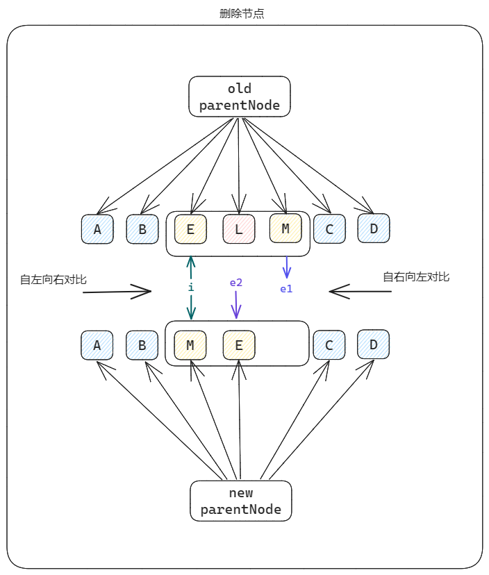

## 前言

​	在前面的文章中，我们把双端对比 diff 算法的收窄区间过程进行问题拆分并逐一实现。后续我们将用代码实现处理收窄区间内的元素，而处理收窄区间内的元素，主要涉及到以下三种 case：

1. oldChildren 存在的节点，在 newChildren 中不存在 （删除节点）
2. oldChildren 中不存在的节点，在 newChildren 中存在 （新增节点）
3. oldChildren 与 newChildren 中共同存在某些节点，但它们的位置可能发生了变动（移动节点）

本文将处理上述的第一种 case（删除节点）



### 更改代码结构

​	在具体的代码实现之前我们先来回顾一下现有的 patchKeyedChildren 代码。

```
  function patchKeyedChildren(
    c1,
    c2,
    container,
    parentComponent,
    parentAnchor
  ) {
    let i = 0;
    let e1 = c1.length - 1;
    let e2 = c2.length - 1;

    function isSomeVNodeType(n1, n2) {
      return n1.type == n2.type && n1.key == n2.key;
    }

    //自左向右对比
    while (i <= e1 && i <= e2) {
      const n1 = c1[i];
      const n2 = c2[i];
      if (isSomeVNodeType(n1, n2)) {
        patch(n1, n2, container, parentComponent, parentAnchor);
        i++;
      } else {
        break;
      }
    }
    //自右向左对比
    while (i <= e1 && i <= e2) {
      const n1 = c1[e1];
      const n2 = c2[e2];
      if (isSomeVNodeType(n1, n2)) {
        patch(n1, n2, container, parentComponent, parentAnchor);
        e1--;
        e2--;
      } else {
        break;
      }
    }

    //恰好左/右半部分是处理区间--只需新增节点
    if (i > e1) {
      while (e2 >= i) {
        const n2 = c2[e2];
        const anchor = e2 + 1 >= c2.length ? null : c2[e2 + 1].el;
        patch(null, n2, container, parentComponent, anchor);
        e2--;
      }
    }

    //恰好左/右半部分是处理区间--只需删除节点
    if (i > e2) {
      while (e1 >= i) {
        const n1 = c1[e1];
        hostRemove(n1.el);
        e1--;
      }
    }
  }
```

大致结构如下

```
  function patchKeyedChildren() {
    //自左向右对比
    while……
    //自右向左对比
    while……

    if (恰好左/右半部分是处理区间--只需新增节点) {……}
    if (恰好左/右半部分是处理区间--只需删除节点) {……}
  }
```

由于后面要处理 **普通情景** 下收窄区间内的元素，而之前实现的是比较特殊的 case，因此我们要更改代码结构如下：

```
  function patchKeyedChildren() {
    //自左向右对比
    while……
    //自右向左对比
    while……

    if (恰好左/右半部分是处理区间--只需新增节点) {……}
    else if (恰好左/右半部分是处理区间--只需删除节点) {……}
    else{
    	/**
    	* todo: 处理普通情景下收窄区间内的元素
    	*/
    }
  }
```

## 代码实现

### 思路梳理

​	删除节点的条件很明了：oldChildren 存在的节点，在 newChildren 中不存在。

​	因此我们一定会去遍历 oldChildren，并在 newChildren 中寻找当前遍历到的 oldChildNode 是否存在于 newChildren 中。

* 如果存在，则只需对该节点进行 patch 即可
* 不存在，则移除该节点

​	那如何判断该节点是否存在于 newChildren 中呢？别忘了我们还有标识节点唯一性的 `key`（这也再一次体现了 `key` 的重要性）。如果 oldChildNode.key 也存在于 newChildren 中，则证明该节点也存在于 newChildren 中。

### 编写代码

更新 <span id='代码实现_patchKeyedChildren'>patchKeyedChildren</span> 代码：

```
  function patchKeyedChildren(
    c1,
    c2,
    container,
    parentComponent,
    parentAnchor
  ) {
	……
	else{
	   /**
       * 删除节点
       */
      const s1 = i;
      const s2 = i;

      // 记录在 newChildren 中匹配到的节点 index
      let newIndex;
      // 遍历 oldChildren
      for (let i = s1; i <= e1; i++) {
        const prevNode = c1[i];
        newIndex = undefined;
        // 从 newChildren 中匹配 oldChildNode
        for (let j = s2; j <= e2; j++) {
          if (isSomeVNodeType(prevNode, c2[j])) {
            newIndex = j;
            break;
          }
        }

        //匹配到，则 patch；反之 remove
        if (newIndex === undefined) {
          hostRemove(prevNode.el);
        } else {
          patch(
            prevNode,
            c2[newIndex],
            container,
            parentComponent,
            parentAnchor
          );
        }
      }
	}
  }
```

## 性能优化

### 空间换时间

​	为了寻找在 oldChildren 中存在；却不存在于 newChildren 中的节点：我们先遍历了 oldChildren ，然后又嵌套 for 循环遍历了 newChildren，从而判断当前遍历到的 oldChildNode 是否也存在于 newChildren 中。

​	但无脑的双重 for 循环去遍历，性能肯定是不好的 `O(c1.length * c2.length)`。遍历 oldChildren 是避免不了的，但我们可以在遍历 newChildren 上动手脚。

​	最简单的就是利用空间换取时间性能：通过维护一个 `Map<newVNode.key, newVNodeIndex>`，从而取代原有的第二层 for 循环，直接通过 key 匹配。

​	而收集这个 `Map<newVNode.key, newVNodeIndex>` 也需要去遍历 newChildren，但不同的是：我们把这层循环遍历提升了一个维度（与遍历 oldChildren 同级别），这样时间复杂度就降到了 `O(c1.length + c2.length)`

更新 <span id='空间换时间_patchKeyedChildren'><a href='#代码实现_patchKeyedChildren'>patchKeyedChildren</a></span> 代码：

```
  function patchKeyedChildren(
    c1,
    c2,
    container,
    parentComponent,
    parentAnchor
  ) {
	……
	else{
      /**
       * 删除节点
       */
      const s1 = i;
      const s2 = i;

      // Map<newVNode.key, newVNodeIndex>
      const keyToNewIndexMap = new Map();
      for (let i = s2; i <= e2; i++) {
        const nextNode = c2[i];
        keyToNewIndexMap.set(nextNode.key, i);
      }

      // 记录在 newChildren 中匹配到的节点 index
      let newIndex;
      // 遍历 oldChildren
      for (let i = s1; i <= e1; i++) {
        const prevNode = c1[i];
        newIndex = undefined;
        // 从 newChildren 中匹配 oldChildNode
        if (prevNode.key != null) {
          newIndex = keyToNewIndexMap.get(prevNode.key);
        } else {
          for (let j = s2; j <= e2; j++) {
            if (isSomeVNodeType(prevNode, c2[j])) {
              newIndex = j;
              break;
            }
          }
        }

        //匹配到，则 patch；反之 remove
        ……
      }
	}
  }
```

#### 细节处理

​	在匹配时，我们做了一个判断：如果 oldChildNode 没有设置 key，则只能通过遍历 newChildren 的形式去匹配。因为没有设置 key，也就相当于 vnode 没有了唯一标识。

```
        if (prevNode.key != null) {
          newIndex = keyToNewIndexMap.get(prevNode.key);
        } else {
          for (let j = s2; j <= e2; j++) {
            if (isSomeVNodeType(prevNode, c2[j])) {
              newIndex = j;
              break;
            }
          }
        }
```


### 特殊 case 优化

​	在收缩区间内：newChildren 中的所有元素，也都存在于 oldChildren 中。

​	其实 [前言](##前言) 中的图示就符合这种特殊 case，只不过这种性能优化所突出的场景是：需要删除的节点特别多的时候。若图中的 oldChildren 收缩区间中还有 `['H','N'……]` 等多个需要删除的节点，这种优化就能够凸显出来。

优化步骤：

1. 定义一个常量 `toBePatchChild` 为 newChildren 待处理区间的长度
2. 定义一个变量 `patched` 用于记录已经打过补丁的节点个数

​	如果在循环匹配的过程中 `patched >= toBePatchChild`，则直接 remove 掉 oldChildNode，并直接退出当次循环，不用执行后续代码逻辑。

​	因为此时收缩区间中的 newChildren 中所有节点都已经被 patch 过了，但是 oldChildren 还有没有检索过的节点，则 oldChildren 中剩下的这些节点相较于 newChildren 一定是多余的。

更新 <a href='#空间换时间_patchKeyedChildren'>patchKeyedChildren</a> 代码：

```
function patchKeyedChildren(
    c1,
    c2,
    container,
    parentComponent,
    parentAnchor
  ) {
    let i = 0;
    let e1 = c1.length - 1;
    let e2 = c2.length - 1;

    function isSomeVNodeType(n1, n2) {
      return n1.type == n2.type && n1.key == n2.key;
    }

    //自左向右对比
    while (i <= e1 && i <= e2) {
      const n1 = c1[i];
      const n2 = c2[i];
      if (isSomeVNodeType(n1, n2)) {
        patch(n1, n2, container, parentComponent, parentAnchor);
        i++;
      } else {
        break;
      }
    }
    //自右向左对比
    while (i <= e1 && i <= e2) {
      const n1 = c1[e1];
      const n2 = c2[e2];
      if (isSomeVNodeType(n1, n2)) {
        patch(n1, n2, container, parentComponent, parentAnchor);
        e1--;
        e2--;
      } else {
        break;
      }
    }

    //恰好左/右半部分是处理区间--只需新增节点
    if (i > e1) {
      while (e2 >= i) {
        const n2 = c2[e2];
        const anchor = e2 + 1 >= c2.length ? null : c2[e2 + 1].el;
        patch(null, n2, container, parentComponent, anchor);
        e2--;
      }
    }
    //恰好左/右半部分是处理区间--只需删除节点
    else if (i > e2) {
      while (e1 >= i) {
        const n1 = c1[e1];
        hostRemove(n1.el);
        e1--;
      }
    } else {
      /**
       * 删除节点
       */
      const s1 = i;
      const s2 = i;

      const toBePatchChild = e2 - s2 + 1;
      let patched = 0;
      // Map<newVNode.key, newVNodeIndex>
      const keyToNewIndexMap = new Map();
      for (let i = s2; i <= e2; i++) {
        const nextNode = c2[i];
        keyToNewIndexMap.set(nextNode.key, i);
      }

      // 记录在 newChildren 中匹配到的节点 index
      let newIndex;
      // 遍历 oldChildren
      for (let i = s1; i <= e1; i++) {
        const prevNode = c1[i];
        if (patched >= toBePatchChild) {
          hostRemove(prevNode.el);
          continue;
        }

        newIndex = undefined;
        // 从 newChildren 中匹配 oldChildNode
        if (prevNode.key != null) {
          newIndex = keyToNewIndexMap.get(prevNode.key);
        } else {
          for (let j = s2; j <= e2; j++) {
            if (isSomeVNodeType(prevNode, c2[j])) {
              newIndex = j;
              break;
            }
          }
        }

        //匹配到，则 patch；反之 remove
        if (newIndex === undefined) {
          hostRemove(prevNode.el);
        } else {
          patch(
            prevNode,
            c2[newIndex],
            container,
            parentComponent,
            parentAnchor
          );
          patched++;
        }
      }
    }
  }
```


