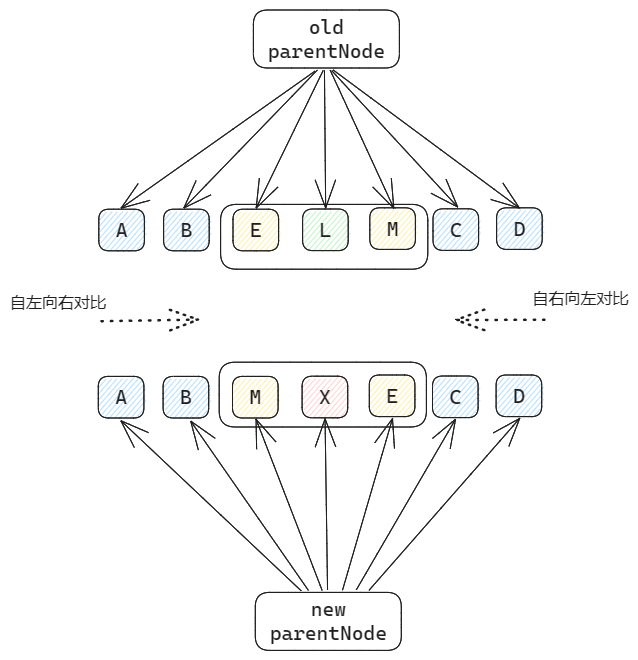
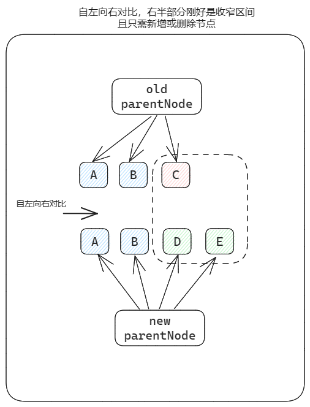
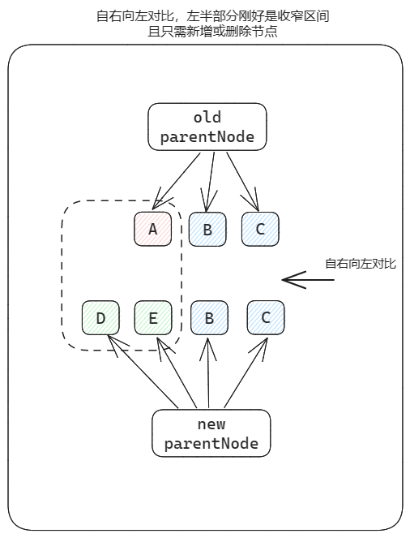
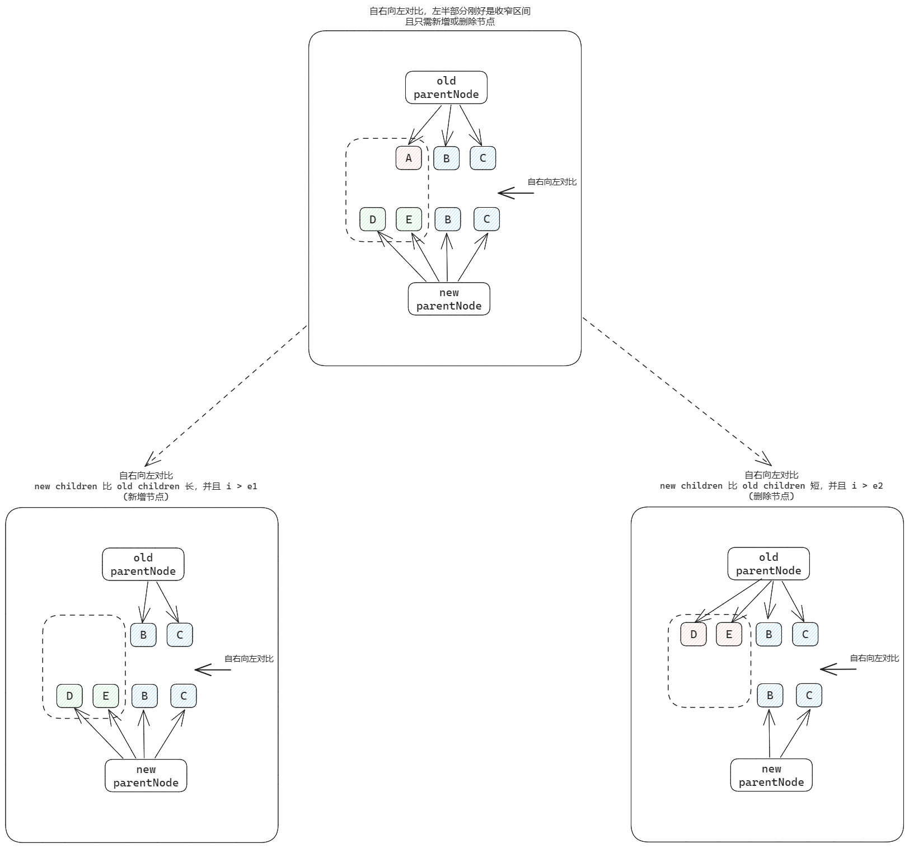
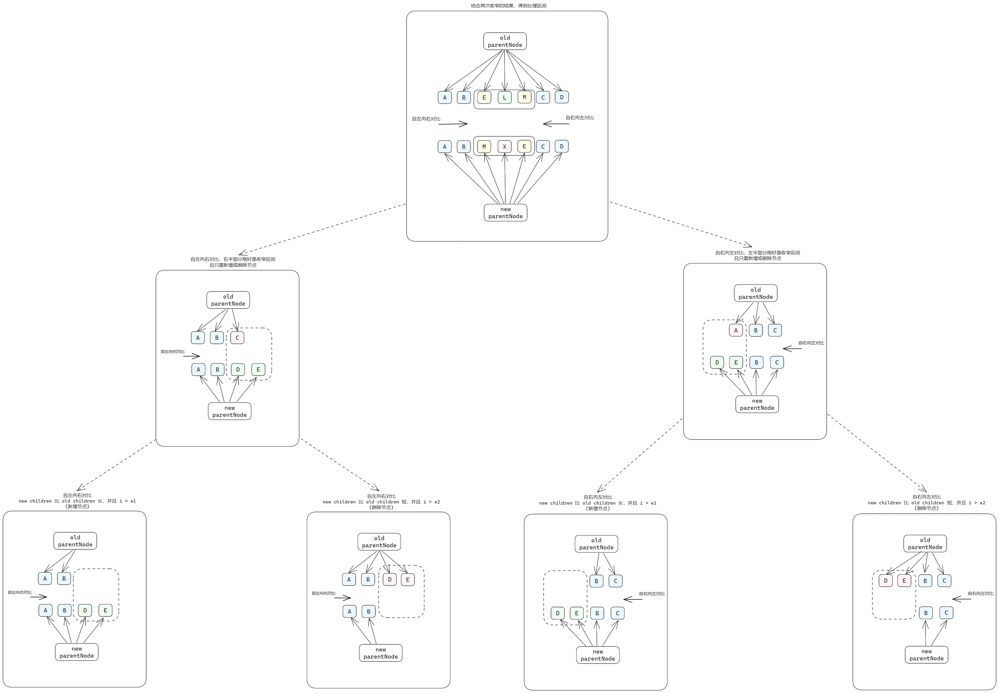

双端对比算法：

1. 先对比左侧，直至找到不同处x
2. 再对比右侧，直至找到不同处y
3. [x,y] 这个区间，就是我们着重关注的地方
   * 遇到新节点就创建
   * 遇到不存在的节点就删除
   * 遇到已存在的节点，但可能顺序遍了，就要将这些节点进行移动

​	双端对比算法的核心，就是找到中间乱序的部分，尽力收窄处理的区间，从而提高性能

将收窄处理区间的情景进行梳理，主要分为以下几个case：

1. 自左向右对比，找到不同处，指针停止移动。此时右半部分恰好就是要处理的区间，并且只需新增或删除节点

   

   1.1 new children 比 old children 长 (新增节点)

   1.2 new children 比 old children 短 (删除节点)

   

2. 自右向左对比，找到不同处，指针停止移动。此时左半部分恰好就是要处理的区间，并且只需新增或删除节点

   

   2.1 new children 比 old children 长 (新增节点)

   2.2 new children 比 old children 短 (删除节点)

   

3. 前两步任何一次单项对比后，并没有那么凑巧(另外部分并不直接是要处理的区间)，此时就要结合前两步骤收窄的结果，得到最终的处理区间（也就是第一张图片所展示的情况）

逻辑梳理图概览：

* 自上而下，逻辑拆分，分而治之
* 自下而上，逐一实现简单case，最终实现整体功能

